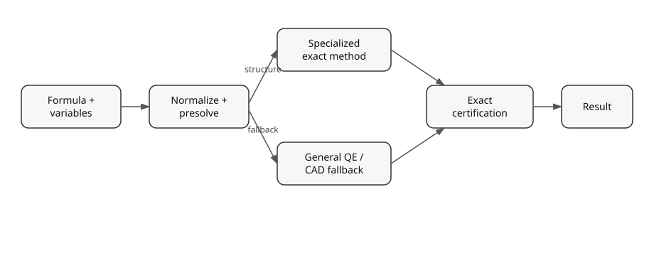
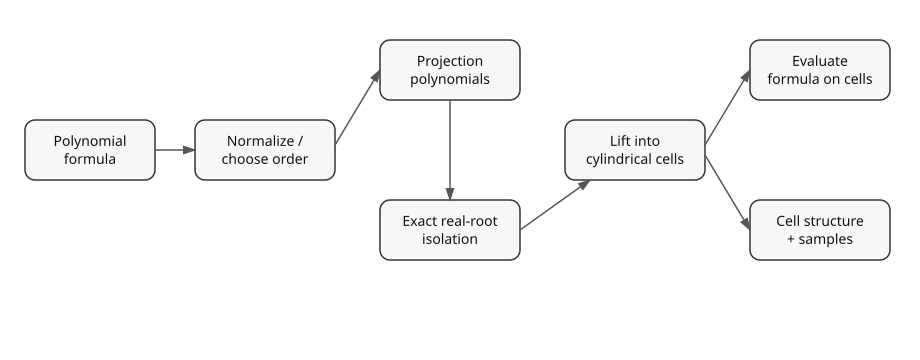
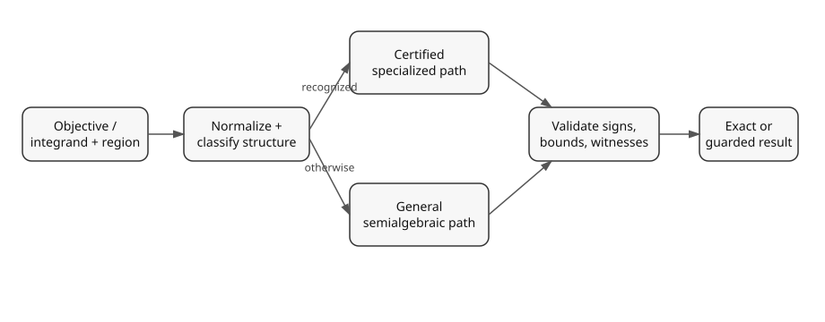

# How computations flow through semialg

The diagrams on this page describe **decision flow**, not a promise that every call executes every box. semialg deliberately tries cheaper certified structure before invoking more general machinery. A fast path may decline a problem; that is not a mathematical `False` result.

## Decision problems

A query such as `is_satisfiable`, `implies`, or `equivalent` is normalized first. Safe structural reductions and specialized exact methods are attempted when their hypotheses can be certified. Candidate conclusions are checked by exact predicates. General algebraic elimination, QE, or CAD remains the fallback for supported polynomial problems.

For implication, semialg reduces the question mathematically to satisfiability of a counterexample set:

\[
A \Rightarrow B \quad\Longleftrightarrow\quad A \land \neg B\text{ is unsatisfiable}.
\]

Equivalence similarly checks the symmetric difference of the two sets.

## Cylindrical algebraic decomposition

CAD turns a multivariate polynomial formula into sign-invariant cylindrical cells. Projection computes lower-dimensional polynomials whose real roots can control changes in sign. Lifting isolates those roots over sample points and constructs sections and sectors. The input formula is then evaluated on the resulting cells. Quantifier elimination, topology, point location, and other operations can consume that certified cell structure.

The exact projection operator and lifting strategy can vary with the problem, so this diagram intentionally describes the invariant architecture rather than one fixed implementation.

## Optimization and integration

Optimization and integration share the same design principle. Recognized one-dimensional, affine, polyhedral, radial, or other structured cases can use specialized exact formulas. A specialization is used only when its required signs, domains, and structural hypotheses are established. Otherwise the operation falls back to general semialgebraic machinery or returns a conservative unsupported/undecided result rather than treating an unproved condition as true.

For parameterized problems, a result may instead be stratified into guarded parameter regimes. See [Parameterized computation](../guides/parameterized_computation.md) and [Assumptions and uncertainty](assumptions_and_uncertainty.md).

## Certification boundary

The important distinction in all three diagrams is between **choosing work** and **establishing truth**. Heuristics may select variable order, decomposition strategy, or a candidate fast path. Mathematical conclusions cross exact zero/equality/sign, root-isolation, witness-validation, or certificate-replay boundaries before they are exposed as certified results.
